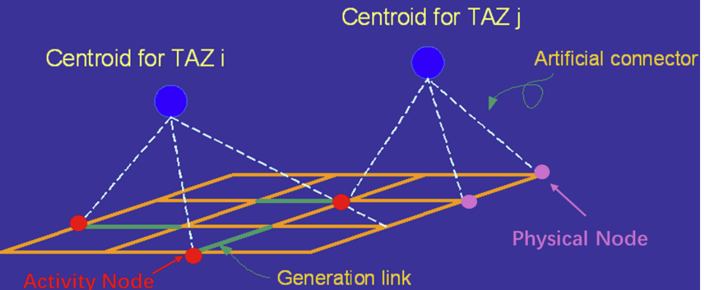

# Connected Transport Network Builder

This project builds a connected transportation network for DTALite traffic assignment tools by combining road network data (from OpenStreetMap) with Zone (Traffic Analysis Zone/ Census Tracts) data. The final outputs are GMNS-compatible files (`node.csv`, `link.csv`, etc.) that can be used for traffic simulation (e.g., in DTALite).

---
## Authors
Henan Zhu, Xuesong (Simon) Zhou, Han Zheng  
Email: henanzhu@asu.edu, xzhou74@asu.edu, hzheng73@asu.edu
---

## 🧰 Prerequisites
- Python 3.11
- Conda (Miniconda or Anaconda)
- Basic understanding of traffic assignment and [General Modeling Network Specification (GMNS)](http://github.com/zephyr-data-specs/GMNS) structure

---
## 🐍 How to Configure the Environment

### Install Conda
If you don't have it already, install:
- [Miniconda](https://docs.conda.io/en/latest/miniconda.html) or
- [Anaconda](https://www.anaconda.com/)

Verify the installation:
```bash
conda --version
```

### Create a Conda Environment
Create a new environment named NetBuilder:
```bash
conda create -n NetBuilder python=3.11 numpy pandas matplotlib -y
conda activate NetBuilder
```

### Install Required Packages
```bash
pip install osm2gmns==1.0.1
pip install 'geopandas[all]'
```
Verify the installations:
```bash
python -c "import osm2gmns as og"
python -c "import geopandas as gpd; print('GeoPandas version:', gpd.__version__)"
```
### Verify the Setup
You can run the following quick test:
```bash
import geopandas as gpd
import pandas as pd
import numpy as np
import matplotlib.pyplot as plt
import osm2gmns as og

print("GeoPandas version:", gpd.__version__)
print("Pandas version:", pd.__version__)
print("NumPy version:", np.__version__)
```

----
## 🚦 Usage Instructions:

This project involves three main processing steps to build a connected GMNS-compatible transport network 
from shapefiles and OpenStreetMap data.

---
### ✅ Step 1: Extract Physical Network from OSM

**Script:** `Read_OSM_File.py`  
**Input:**  
- OSM `.osm` file (e.g., `data/Tempe.osm`)

**Output:** Physical network 
- `node.csv`  
- `link.csv`  

This step extracts the **physical road network** from an OSM map file and generates a base **GMNS-style network** with `node.csv` and `link.csv`.
> ℹ️ For more information about OSM file formats, see the [OpenStreetMap Wiki](https://wiki.openstreetmap.org/wiki/OSM_file_formats).

---
### ✅ Step 2: Extract Zone Centroid Data
### 🗺️ Prepare Zone Geometry and Centroids

This step provides instructions to locate zone data and prepare the polygon geometry and centroid information. 
The output should include each zone’s **centroid coordinates** (longitude, latitude) and polygon geometry in **Well-Known Text (WKT)** format.


You can source zone (TAZ/Census Tracts) data from the following resources:

1. **Use Census Tracts as Zones**  
   Shapefiles for U.S. census tracts are available here:  
   👉 [U.S. Census Bureau - Census Tracts Shapefiles (2021)](https://www.census.gov/cgi-bin/geo/shapefiles/index.php?year=2021&layergroup=Census+Tracts)

2. **City/County-specific GIS data**  
   Some cities and counties provide public access to tract shapefiles:
   - [Phoenix Census Tracts (2010)](https://koordinates.com/layer/96425-phoenix-arizona-census-tracts-2010/)
   - [Tempe Census Tracts (2020)](https://data.tempe.gov/datasets/f278c2c622c249b0a543d9cc31dba525_0/explore)

**Script:** `Read_Zone_Data.py`     
**Input:**
- Zone (TAZ/Census Tracts) shapefiles (e.g., `Census_Tract_Boundary.shp`, .dbf, .shx, .prj, etc.)

**Output:**      
- `zone_centroid.csv`
---
### ✅ Step 3: Generate Connected Network
### 🧩 Connect Zone Centroids with the Physical Network

To streamline GMNS network creation for tools like **TransCAD**, **Cube**, **VISUM**, **DTALite**, and **path4gmns**, 
this step connects **Zone centroids** to the physical network using:

- **Activity nodes** (red dots in the diagram)  
- **Connector links** (green lines)  
- **Artificial connectors** to physical nodes

This design follows the **Forward Star Structure**, where each **zone centroid** is a central hub connected to nearby network nodes, improving performance and compatibility for traffic assignment.



🔎 **Simple way to identify activity nodes**:  
An **activity node** is any node in `node.csv` that has a non-null `zone_id` value.

📘 For detailed explanation of the Forward Star Network Structure, see the  
👉 [TAPLite Wiki: Forward Star Structure – Centroid Nodes and Connectors](https://github.com/asu-trans-ai-lab/TAPLite/wiki/Forward-Star-Network-Structure%3A-Centroid-Nodes-and-Connectors)

**Script:** `Connector_Generation.py`
**Input:**  
- `node.csv`  
- `link.csv`  
- `zone_centroid.csv`

**Output (`connected_network` folder):**
- `node_updated.csv` → **Rename to** `node.csv` for DTALite compatibility
- `link_updated.csv` → **Rename to** `link.csv` for DTALite compatibility

> ⚠️ These two files are critical outputs and must be renamed to `node.csv` and `link.csv` respectively in order to be used with the DTALite traffic assignment tool.

> ✅ Finally, your connected network consisting of the final versions of `node.csv` and `link.csv`, is ready for DTALite-based traffic assignment.

---

## 📄GMNS Format for DTALite

Before using your output files in DTALite, please review the required [GMNS file format specifications](https://docs.google.com/document/d/146Nt9y53mUibze1Z0nezgCwtkY_4Ycb1j-wp_S86wqs/edit?usp=sharing) to ensure full compatibility.

This includes required fields and formatting for:
- `node.csv`
- `link.csv`
- `demand.csv`

> ⚠️ Files must strictly follow GMNS standards for successful DTALite traffic assignment.

---
### 📦 Save or Share the Environment
To save your environment to a file:
```bash
conda env export > environment.yml
```
To recreate it later or on another machine:
```bash
conda env create -f environment.yml
conda activate transport-net-builder
```

### 📝 Notes

- Ensure all shapefile components (`.shp`, `.shx`, `.dbf`, `.prj`) are inside the `data/` folder.
- For advanced GIS operations:

```bash
pip install gdal
```
- To use Jupyter Notebook:
```bash
conda install jupyter -y
```